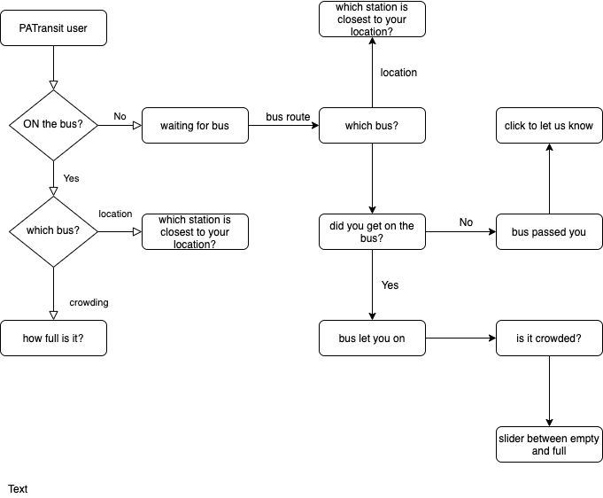
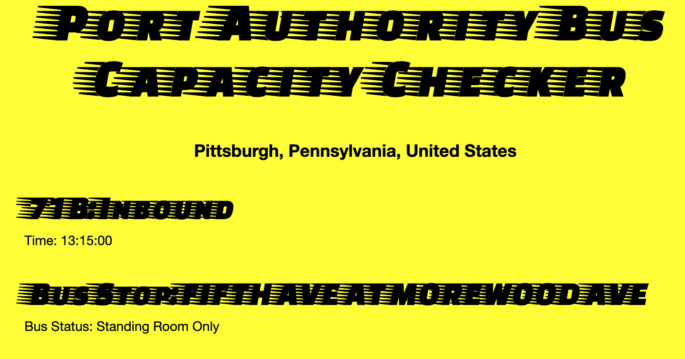

# BusCrowd_SheInnovates2020
# Are you tired of crowded busses passing you?
# BusCrowd can help!
### Crowding data collected and connected to PATransity use stats
#### Main Goal: To develop a website that helps PATransit users in Pittsburgh PA see if the bus they want to take is crowded or not.
##### Benefits:
1. Reduce bus crowding
2. Better bus user experience
3. Increase mass transit usage
4. Increase relevant data to PATransit to adjust routes accordingly

##### Example screenshot:

